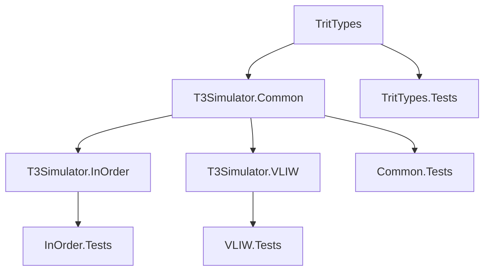

# T3 Ternary Processor — План реализации (обновлённая версия)

## Обзор

Реализация симулятора троичного процессора T3 на C# согласно спецификации.  
Проект организован как .NET-решение с несколькими проектами, основное внимание уделено ядру симулятора (TritTypes, Common, InOrder, VLIW) и тестам (MsTests).

Архитектура поддерживает две конфигурации:
- **T3‑18** — 18‑тритное слово (основная)
- **T3‑54** — 54‑тритное слово (включая VLIW)

---

## Архитектура решения

```
T3Sharp.sln
├── src/
│   ├── TritTypes/               # Базовые троичные типы (Trit, Tryte, Word18, Word54)
│   ├── T3Simulator.Common/      # Интерфейсы, базовые классы, общая инфраструктура
│   ├── T3Simulator.InOrder/     # Последовательный процессор (T3‑18, T3‑54)
│   └── T3Simulator.VLIW/        # VLIW‑процессор (только T3‑54)
└── tests/
    ├── TritTypes.Tests/
    ├── T3Simulator.Common.Tests/
    ├── T3Simulator.InOrder.Tests/
    └── T3Simulator.VLIW.Tests/
```

---

## Фазы реализации

### Фаза 1: Фундамент — TritTypes

**Цель:** Реализовать базовые троичные типы данных, от которых зависит всё остальное.

| # | Задача | Описание | Ключевые типы/методы |
|---|--------|----------|----------------------|
| 1.1 | `Trit` struct | Тип значения для –1, 0, +1 с операторами | `struct Trit` с неявными преобразованиями, `ToString(\"-0+\")` |
| 1.2 | `Tryte` struct | 6‑тритный адресуемый блок, диапазон –364…+364 | `struct Tryte`, арифметика, преобразование в/из `Trit[]` |
| 1.3 | `Word18` struct | 18‑тритное слово для T3‑18, хранится в `long` (проверка границ) | `struct Word18` со сбалансированной троичной арифметикой, `ToLong()`, `FromLong()` |
| 1.4 | `Word54` struct | 54‑тритное слово для T3‑54, использует `Int128` | `struct Word54`, арифметика, разложение на три 18‑тритных слота |
| 1.5 | `TritArray` утилиты | Помощники для потритовых операций над массивами тритов | `TritArray.And()`, `.Or()`, `.Xor()`, `.ShiftLeft()`, `.ShiftRight()` |
| 1.6 | `BalancedTernary` конвертер | Преобразование между троичной и двоичной формами | `ToLong()`, `FromLong()`, `ToString()` |
| 1.7 | `TScii` класс | Кодировка T-SCII для текста (6‑тритные символы) | `ToChar()`, `FromChar()`, `ToNinary()`, `ToTryx()` |
| 1.8 | `TritEncoding` класс | Кодирование тритов в различные форматы | `ToNinary()`, `FromNinary()`, `ToTryx()`, `FromTryx()`, `ToBinary()` |

**Критерии приёмки:**
- Значения `Trit` ограничены –1, 0, +1
- Арифметика `Word18`/`Word54` соответствует правилам сбалансированной троичной системы
- Циклическое преобразование: `long → Word18 → long` сохраняет значение
- Корректная обработка граничных случаев: ноль, максимальное положительное, минимальное отрицательное

---

### Фаза 2: Общие абстракции — T3Simulator.Common

**Цель:** Определить интерфейсы, базовые классы, перечисления и общую инфраструктуру.

| # | Задача | Описание |
|---|--------|----------|
| 2.1 | `Opcode` enum | Коды операций 0–81 (HALT…CMPI), включая I‑типы |
| 2.2 | `Instruction<TWord>` struct | Декодированная инструкция: базовый опкод, предикат, op1, op2, op3, immediate |
| 2.3 | `T3Config` enum | `T3_18`, `T3_54` с размером слова, числом регистров, размером памяти |
| 2.4 | `IDevice` интерфейс | `Read()`, `Write()`, `DataReady` для устройств ввода‑вывода |
| 2.5 | `ProcessorState` класс | Снимок всех регистров (RW…R4, SP, PC, Cond, PR), WP, циклы/инструкции/остановы |
| 2.6 | `IT3Processor` интерфейс | `LoadProgram()`, `Reset()`, `Step()`, `Run()`, регистрация устройств, получение состояния |
| 2.7 | `ProcessorBase` абстрактный класс | Общая логика: регистровый файл, память, стек, менеджер устройств, подсчёт циклов |
| 2.8 | `InstructionDecoder` | Декодирование `Word18`/`Word54` в `Instruction` (R‑ и I‑форматы) |
| 2.9 | `Memory` класс | Словесно‑адресуемая память, 1M слов, отображение счётчиков MMIO |
| 2.10 | `DeviceManager` класс | Маршрутизация портового ввода‑вывода, обработка остановов |
| 2.11 | `RegisterWindow` класс | Логика оконного регистрового файла (для T3‑54 с 27 регистрами, если поддерживается) — в базовой версии может отсутствовать или быть упрощена до 9 регистров |
| 2.12 | `PredicateEvaluator` | Проверка флагов предикации из регистра PR (3 флага для T3‑18, 9 флагов для T3‑54) |
| 2.13 | `T3Disassembler` | Обратное преобразование машинного кода в мнемоники |

**Ключевые решения:**
- `ProcessorBase` реализует `IT3Processor` и предоставляет виртуальные методы для переопределения в конкретных процессорах
- Память отображает счётчики циклов по адресам `0x3FFFF00`–`0x3FFFF02` (18‑тритные адреса)
- Менеджер устройств хранит словарь `(порт → IDevice)`

---

### Фаза 3: Последовательный процессор — T3Simulator.InOrder

**Цель:** Реализовать in‑order процессор для T3‑18 и T3‑54.

| # | Задача | Описание |
|---|--------|----------|
| 3.1 | `T3InOrderProcessor` класс | Основной класс процессора, наследующий `ProcessorBase` |
| 3.2 | Исполнительный движок | Центральный диспетчер для опкодов 0–81 (HALT…CMPI) |
| 3.3 | Операции АЛУ | ADD, SUB, MUL, DIV, MOD, NEG в сбалансированной троичной системе |
| 3.4 | Потритовые логические операции | TRITAND, TRITOR, TRITXOR |
| 3.5 | Операции сдвига | SHL (умножение на 3^op2), SHR (арифметический сдвиг вправо) |
| 3.6 | Операции с памятью | LOAD, STORE, LOADI, STOREI с пословной адресацией |
| 3.7 | Непосредственные операции | LI, LI_I (imm6 из I‑типа), LIMM (следующее слово) |
| 3.8 | Управление потоком | JMP, JE, JNE, JL, JG, JM с использованием Cond |
| 3.9 | Подпрограммы | CALL, RET (стековый вызов, без оконного механизма для T3‑18; для T3‑54 может быть добавлено окно позже) |
| 3.10 | Стековые операции | PUSH, POP |
| 3.11 | Операции ввода‑вывода | IN, OUT, INI, OUTI через DeviceManager |
| 3.12 | Учёт задержек | Тактово‑точная модель выполнения согласно таблице задержек |
| 3.13 | Обработка исключений | Недопустимые опкоды (28–44 в T3‑18) генерируют исключение |
| 3.14 | Обработка HALT | Остановка выполнения, `Step()` возвращает `false` |

**Таблица задержек (такты) для T3‑18 / T3‑54:**

| Инструкция | T3‑18 | T3‑54 |
|------------|-------|-------|
| HALT, MOV, LI, NEG, TRITAND, TRITOR, TRITXOR, CMP | 1 | 1 |
| LOAD, STORE | 2 | 2 |
| ADD, SUB, SHL, SHR | 1 | 1 |
| MUL | 5 | 8 |
| DIV, MOD | 10 | 15 |
| JMP | 1 | 1 |
| JE, JNE, JL, JG, JM | 1 (не перех.) / 2 (перех.) | 1/2 |
| CALL, RET | 2 | 2 |
| PUSH, POP | 2 | 2 |
| LIMM | 2 | 2 |
| IN, OUT, INI, OUTI | 2 | 2 |

---

### Фаза 4: VLIW процессор — T3Simulator.VLIW

**Цель:** Реализовать высокопроизводительный VLIW‑процессор только для T3‑54.

| # | Задача | Описание |
|---|--------|----------|
| 4.1 | `T3VliwProcessor` класс | Основной класс VLIW‑процессора, наследующий `ProcessorBase` |
| 4.2 | `VliwBundle` struct | Декодированный бандл из трёх слотов (18 трит каждый) из одного `Word54` |
| 4.3 | `VliwSlot` struct | 18‑тритный слот: `opcode+pred (6)`, `op1 (6)`, `op2 (6)` |
| 4.4 | Трёх‑АЛУ диспетчер | Параллельное выполнение с детектированием конфликтов |
| 4.5 | Разрешение конфликтов | Регистровый конфликт (недопустим), конфликт памяти (приоритет: слот 0>1>2), конфликт переходов |
| 4.6 | Послотная предикация | Каждый слот имеет свой предикатный флаг |
| 4.7 | Спекулятивное выполнение | SPEK (сохранить теневые регистры + буфер записи), COMMIT (применить), ROLLBACK (восстановить) |
| 4.8 | SIMD‑операции | VADD3, VSUB3, VMUL3, VDOT3, VCMP, VTRITAND3, VTRITOR3, VTRITXOR3, VSHL3, VSHR3 |
| 4.9 | Полная поддержка опкодов | Все 82+ опкодов доступны на любом АЛУ |
| 4.10 | Точное тактовое моделирование | SIMD – 1 такт; остальные инструкции соответствуют in‑order задержкам |

**Правила VLIW:**
- Бандл = 3 слота в одном 54‑тритном слове
- Двум слотам запрещено писать в один и тот же регистр
- Не более одного обращения к памяти на бандл (приоритет слот 0 > 1 > 2)
- Не более одного перехода на бандл
- Спекуляция: теневой регистровый файл + отложенный буфер записи

---

### Фаза 5: Тестирование — все тестовые проекты

**Цель:** Обеспечить полное покрытие тестами с использованием **MSTest**.

| # | Задача | Описание |
|---|--------|----------|
| 5.1 | `TritTypes.Tests` | Модульные тесты для Trit, Tryte, Word18, Word54, конвертации |
| 5.2 | `Common.Tests` | Тесты InstructionDecoder, Memory, DeviceManager, RegisterWindow, PredicateEvaluator |
| 5.3 | `InOrder.Tests` — АЛУ | Тесты ADD, SUB, MUL, DIV, MOD, NEG |
| 5.4 | `InOrder.Tests` — Логика | Тесты TRITAND, TRITOR, TRITXOR |
| 5.5 | `InOrder.Tests` — Сдвиги | Тесты SHL, SHR |
| 5.6 | `InOrder.Tests` — Память | Тесты LOAD, STORE, LI, LIMM |
| 5.7 | `InOrder.Tests` — Управление | Тесты JMP, JE, JNE, JL, JG, JM |
| 5.8 | `InOrder.Tests` — Подпрограммы | Тесты CALL, RET, регистровое окно (если есть) |
| 5.9 | `InOrder.Tests` — Стек | Тесты PUSH, POP |
| 5.10 | `InOrder.Tests` — Ввод/вывод | Тесты IN, OUT, INI, OUTI с имитаторами устройств |
| 5.11 | `InOrder.Tests` — Задержки | Проверка количества тактов для каждой инструкции |
| 5.12 | `InOrder.Tests` — Интеграционные | Факториал, рекурсивные вызовы, полноценные программы |
| 5.13 | `VLIW.Tests` — Бандл | Декодирование бандла, извлечение слотов |
| 5.14 | `VLIW.Tests` — Параллелизм | Трёх‑АЛУ выполнение, обнаружение конфликтов |
| 5.15 | `VLIW.Tests` — Предикация | Послотная оценка предикатов |
| 5.16 | `VLIW.Tests` — Спекуляция | Корректность SPEK/COMMIT/ROLLBACK |
| 5.17 | `VLIW.Tests` — SIMD | Все векторные операции, VDOT3, VCMP → PR |
| 5.18 | `VLIW.Tests` — Интеграционные | Комбинированные VLIW‑программы |

---

## Диаграммы потоков данных

### Исполнение инструкции в In‑Order

```mermaid
flowchart LR
    A[Выборка: чтение Word18 из mem[PC]] --> B[Декодер: InstructionDecoder]
    B --> C{Опкод корректен?}
    C -->|0-81| D[Вычисление предиката]
    C -->|28-44| E[Исключение недопустимой операции]
    D --> F{Предикат истинен?}
    F -->|Да| G[Выполнение инструкции]
    F -->|Нет| H[NOP - пропуск]
    G --> I[Обновить PC, cycle_count, inst_count]
    H --> I
    I --> J{HALT?}
    J -->|Нет| A
    J -->|Да| K[Останов]
```

### Исполнение VLIW бандла

```mermaid
flowchart LR
    A[Выборка: чтение Word54 из mem[PC]] --> B[Декодирование 3 VliwSlot]
    B --> C[Обнаружение конфликтов]
    C --> D{Регистровый конфликт?}
    D -->|Да| E[Ошибка: недопустимый бандл]
    D -->|Нет| F{Конфликт памяти?}
    F -->|Да| G[Выполнить слот 0; слоты 1,2 ждут 1 такт]
    F -->|Нет| H[Выполнить все 3 слота параллельно]
    G --> I[Обновить PC, счётчики]
    H --> I
    I --> J{HALT?}
    J -->|Нет| A
    J -->|Да| K[Останов]
```

---

## Зависимости между фазами



---

## Ключевые детали реализации

### Кодирование тритов
- `Trit` хранится как `sbyte` со значениями -1, 0, 1
- `Tryte` = 6 тритов, упакованных в `short` (9 бит), с проверкой диапазона
- `Word18` = 18 тритов → помещается в `long` (знаковое 64‑битное) с проверкой
- `Word54` = 54 трита → требует `Int128` или собственную структуру

### Кодирование инструкций (18‑тритное слово)
**R‑тип (регистр–регистр):**
```
[ opcode+pred (6) | op1 (3) | op2 (3) | op3 (3) | резерв (3) ]
```
**I‑тип (регистр–непосредственное значение):**
```
[ opcode+pred (6) | op1 (3) | op2 (3) | imm6 (6) ]
```
- `opcode+pred` = базовый_опкод + pred_index * 28
- Базовый опкод = значение % 28; предикат = значение / 28
- Регистровые поля (op1, op2, op3) – числа 0–8, соответствующие RW, RX, RY, RZ, R0, R1, R2, R3, R4
- `imm6` – 6 тритов (значение –364…+364)

Для инструкций I‑типа используется отдельный код (например, ADDI = 70, а не ADD + 64). Это упрощает декодирование.

### Кодирование VLIW слота (18 трит)
```
[ opcode+pred (6) | op1 (6) | op2 (6) ]
```
- 6‑тритные операнды: 0–8 обозначают регистры, 9+ – непосредственное значение (диапазон –364…+364)

### Карта памяти
| Адрес (18‑тритный) | Описание |
|---------------------|----------|
| `0x00000` – `0xFFFFF` | Программная память (1M слов) |
| `0x3FFFF00` | CYCLE_LOW (чтение/запись; запись сбрасывает все счётчики) |
| `0x3FFFF01` | INST_COUNT |
| `0x3FFFF02` | STALL_COUNT |
| `0x3FFFF10` | TIMER_CTRL |
| `0x3FFFF11` | TIMER_CMP |

### Карта портов ввода‑вывода
| Порт | Устройство |
|------|------------|
| 0 | stdout |
| 1 | stdin |
| 2 | stderr |
| 3–7 | Свободные / пользовательские |
| 0x10–0x1F | Управление таймером / MMIO |

### Названия регистров
- Общего назначения: `RW, RX, RY, RZ, R0, R1, R2, R3, R4` (номера 0–8)
- Специальные: `SP`, `PC`, `Cond`, `PR`

### Форматы вывода троичных значений
- **Троичная строка**: `0t+0-0+0...` (6 символов для трайта, 18/54 для слов)
- **9‑ричный (Ninary)**: `0nY12` (3 символа для трайта)
- **27‑ричный (Tryx)**: `0y2B` (2 символа для трайта)

### FPU (сопроцессор с плавающей точкой)

**FPU пока не реализован.** Опкоды 92–108 зарезервированы для будущей реализации и в текущей версии не используются.
