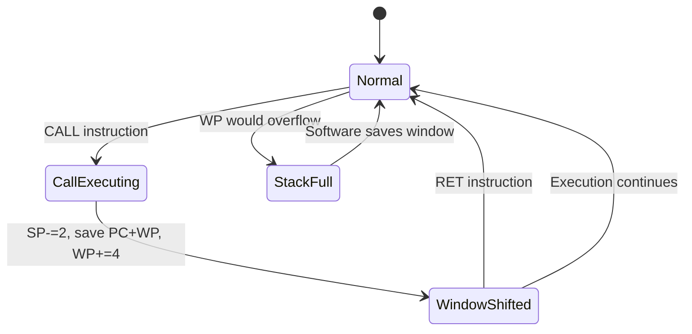
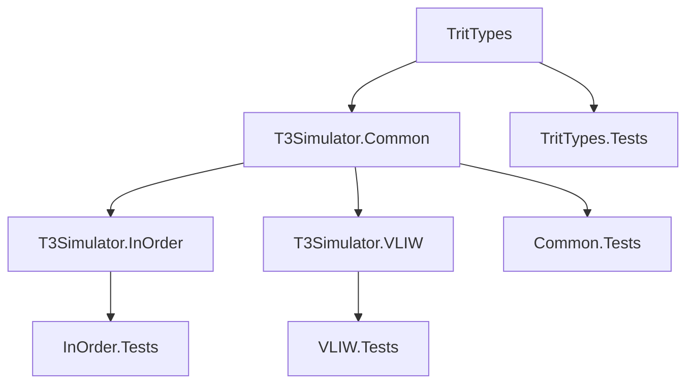

# T3 Ternary Processor — Implementation Plan

## Overview

Implementation of the T3 ternary processor simulator in C# based on the specification in `plan.md`. The project is organized as a .NET solution with multiple projects, focusing on the simulator core (TritTypes, Common, InOrder, VLIW) and tests (Use MsTests).

---

## Solution Architecture

```
T3Sharp.sln
├── src/
│   ├── TritTypes/               # Basic ternary types (trit, tryte, word)
│   ├── T3Simulator.Common/      # Interfaces, base classes, shared types
│   ├── T3Simulator.InOrder/     # In-order processor (T3-27, T3-54)
│   └── T3Simulator.VLIW/        # VLIW processor (T3-54 only)
└── tests/
    ├── TritTypes.Tests/
    ├── T3Simulator.Common.Tests/
    ├── T3Simulator.InOrder.Tests/
    └── T3Simulator.VLIW.Tests/
```

---

## Implementation Phases

### Phase 1: Foundation — TritTypes Project

**Goal:** Implement the core ternary data types that everything else depends on.

| # | Task | Description | Key Types/Methods |
|---|------|-------------|-------------------|
| 1.1 | `Trit` struct | Value type for -1, 0, +1 with operators | `struct Trit` with implicit conversions, `ToString("-0+")` |
| 1.2 | `Tryte` struct | 6-trit addressable unit, range -364..+364 | `struct Tryte` with arithmetic, conversion to/from `Trit[]` |
| 1.3 | `Word27` struct | 27-trit word for T3-27 | `struct Word27` with balanced ternary arithmetic, conversion to `long` |
| 1.4 | `Word54` struct | 54-trit word for T3-54 | `struct Word54` with balanced ternary arithmetic, conversion to `BigInteger` |
| 1.5 | `TritArray` utilities | Helper for trit-level operations | `TritArray.And()`, `.Or()`, `.Xor()`, `.ShiftLeft()`, `.ShiftRight()` |
| 1.6 | `BalancedTernary` converter | Conversion between ternary and binary | `ToLong()`, `FromLong()`, `ToString()` |

**Validation criteria:**
- `Trit` values are constrained to -1, 0, +1 at construction
- Arithmetic on `Word27`/`Word54` matches balanced ternary rules
- Round-trip conversion: `long → Word27 → long` preserves value
- All edge cases: zero, max positive, max negative

---

### Phase 2: Common Abstractions — T3Simulator.Common Project

**Goal:** Define interfaces, base classes, enums, and shared infrastructure.

| # | Task | Description |
|---|------|-------------|
| 2.1 | `Opcode` enum | All 45 opcodes (0-44) with `PredicateIndex` property |
| 2.2 | `Instruction` struct | Decoded instruction: opcode, predicate, operand1, operand2 |
| 2.3 | `T3Config` enum | `T3_27`, `T3_54` with word size, register count, memory size |
| 2.4 | `IDevice` interface | `Read()`, `Write()`, `DataReady` for I/O devices |
| 2.5 | `ProcessorState` class | Snapshot of all registers, PC, Cond, PR, WP, cycle/inst/stall counts |
| 2.6 | `IT3Processor` interface | `LoadProgram()`, `Reset()`, `Step()`, `Run()`, device registration, state |
| 2.7 | `ProcessorBase` abstract class | Shared logic: register file, memory, stack, device manager, cycle counting |
| 2.8 | `InstructionDecoder` | Decode `Word27`/`Word54` into `Instruction` structs |
| 2.9 | `Memory` class | Word-addressable memory, 1M words, MMIO-mapped counters |
| 2.10 | `DeviceManager` class | Port-based I/O routing, stall handling |
| 2.11 | `RegisterWindow` class | Window pointer logic: `CALL`/`RET` save/restore, parameter passing |
| 2.12 | `PredicateEvaluator` | Evaluate predicate flags from `PR` register |

**Key design decisions:**
- `ProcessorBase` implements `IT3Processor` and provides hooks for subclasses to override execution
- Memory maps cycle counters at `0xFFFFFF00-0xFFFFFF03` as specified
- Device manager uses a dictionary of `(port → IDevice)`

---

### Phase 3: In-Order Processor — T3Simulator.InOrder Project

**Goal:** Implement the sequential in-order processor for both T3-27 and T3-54 configurations.

| # | Task | Description |
|---|------|-------------|
| 3.1 | `T3InOrderProcessor` class | Main processor class extending `ProcessorBase` |
| 3.2 | Instruction execution engine | Central dispatch for opcodes 0-27 (HALT through POP) |
| 3.3 | ALU operations | ADD, SUB, MUL, DIV, MOD, NEG with balanced ternary |
| 3.4 | Tritwise logic operations | TRITAND, TRITOR, TRITXOR |
| 3.5 | Shift operations | SHL (multiply by 3^op2), SHR (arithmetic right shift) |
| 3.6 | Memory operations | LOAD, STORE with word addressing |
| 3.7 | Immediate operations | LI (9-trit immediate), LIMM (next word) |
| 3.8 | Control flow | JMP, JE, JNE, JL, JG, JM with Cond register |
| 3.9 | Subroutine operations | CALL (window save/shift), RET (window restore) |
| 3.10 | Stack operations | PUSH, POP |
| 3.11 | I/O operations | IN, OUT, INI, OUTI via DeviceManager |
| 3.12 | Instruction timing | Cycle-accurate timing per instruction (from spec table) |
| 3.13 | Exception handling | Invalid opcode (28-44) raises exception in in-order mode |
| 3.14 | HALT handling | Stop execution, `Step()` returns false |

**Instruction timing table (from spec):**

| Instruction | T3-27 | T3-54 |
|-------------|-------|-------|
| HALT, MOV, LI, NEG, TRITAND, TRITOR, TRITXOR, CMP | 1 | 1 |
| LOAD, STORE | 2 | 2 |
| ADD, SUB, SHL, SHR | 1 | 1 |
| MUL | 5 | 8 |
| DIV, MOD | 10 | 15 |
| JMP | 1 | 1 |
| JE, JNE, JL, JG, JM | 1/2 | 1/2 |
| CALL, RET | 2 | 2 |
| PUSH, POP | 2 | 2 |
| LIMM | 2 | 2 |
| IN, OUT, INI, OUTI | 2 | 2 |

---

### Phase 4: VLIW Processor — T3Simulator.VLIW Project

**Goal:** Implement the high-performance VLIW processor for T3-54 only.

| # | Task | Description |
|---|------|-------------|
| 4.1 | `T3VliwProcessor` class | Main VLIW processor extending `ProcessorBase` |
| 4.2 | `VliwBundle` struct | Decoded 3-slot bundle from a single Word54 |
| 4.3 | `VliwSlot` struct | 18-trit slot: opcode (6), op1 (6), op2 (6) |
| 4.4 | Three-ALU dispatch | Parallel execution with conflict detection |
| 4.5 | Conflict resolution | Register conflict (forbidden), memory conflict (priority: slot 0>1>2), branch conflict |
| 4.6 | Per-slot predication | Each slot has its own predicate flag |
| 4.7 | Speculative execution | SPEK (save shadow regs + write buffer), COMMIT (apply), ROLLBACK (restore) |
| 4.8 | SIMD vector operations | VADD3, VSUB3, VMUL3, VDOT3, VCMP, VTRITAND3, VTRITOR3, VTRITXOR3, VSHL3, VSHR3 |
| 4.9 | Full opcode support | All 45 opcodes available on any ALU |
| 4.10 | Cycle-accurate timing | SIMD: 1 cycle; other instructions match in-order timing |

**VLIW-specific rules:**
- Bundle = 3 slots in one 54-trit word
- No two slots may write to the same register
- At most one memory access per bundle (priority: slot 0 > 1 > 2)
- At most one branch per bundle
- Speculation: shadow register file + deferred write buffer

---

### Phase 5: Testing — All Test Projects

**Goal:** Comprehensive test coverage using **MSTest**.

| # | Task | Description |
|---|------|-------------|
| 5.1 | `TritTypes.Tests` | Unit tests for Trit, Tryte, Word27, Word54, conversions |
| 5.2 | `Common.Tests` | Tests for InstructionDecoder, Memory, DeviceManager, RegisterWindow, PredicateEvaluator |
| 5.3 | `InOrder.Tests` — ALU | Tests for ADD, SUB, MUL, DIV, MOD, NEG |
| 5.4 | `InOrder.Tests` — Logic | Tests for TRITAND, TRITOR, TRITXOR |
| 5.5 | `InOrder.Tests` — Shifts | Tests for SHL, SHR |
| 5.6 | `InOrder.Tests` — Memory | Tests for LOAD, STORE, LI, LIMM |
| 5.7 | `InOrder.Tests` — Control flow | Tests for JMP, JE, JNE, JL, JG, JM |
| 5.8 | `InOrder.Tests` — Subroutines | Tests for CALL, RET, register window |
| 5.9 | `InOrder.Tests` — Stack | Tests for PUSH, POP |
| 5.10 | `InOrder.Tests` — I/O | Tests for IN, OUT, INI, OUTI with mock devices |
| 5.11 | `InOrder.Tests` — Timing | Cycle count verification per instruction |
| 5.12 | `InOrder.Tests` — Integration | Factorial, recursive calls, full programs |
| 5.13 | `VLIW.Tests` — Bundle | Bundle decode, slot extraction |
| 5.14 | `VLIW.Tests` — Parallel | Three-ALU execution, conflict detection |
| 5.15 | `VLIW.Tests` — Predication | Per-slot predicate evaluation |
| 5.16 | `VLIW.Tests` — Speculation | SPEK/COMMIT/ROLLBACK correctness |
| 5.17 | `VLIW.Tests` — SIMD | All vector operations, VDOT3, VCMP → PR |
| 5.18 | `VLIW.Tests` — Integration | Combined VLIW programs |

---

## Data Flow Diagrams

### Instruction Execution Flow (In-Order)

```mermaid
flowchart LR
    A[Fetch: Read Word27 from mem[PC]] --> B[Decode: InstructionDecoder]
    B --> C{Opcode valid?}
    C -->|0-27| D[Evaluate predicate]
    C -->|28-44| E[Raise InvalidOpcode]
    D --> F{Predicate true?}
    F -->|Yes| G[Execute instruction]
    F -->|No| H[NOP - skip]
    G --> I[Update PC, cycle_count, inst_count]
    H --> I
    I --> J{HALT?}
    J -->|No| A
    J -->|Yes| K[Stop]
```

### VLIW Bundle Execution Flow

```mermaid
flowchart LR
    A[Fetch: Read Word54 from mem[PC]] --> B[Decode 3 VliwSlots]
    B --> C[Detect conflicts]
    C --> D{Register conflict?}
    D -->|Yes| E[Raise: illegal bundle]
    D -->|No| F{Memory conflict?}
    F -->|Yes| G[Execute slot 0; slot 1,2 stall 1 cycle]
    F -->|No| H[Execute all 3 slots in parallel]
    G --> I[Update PC, counters]
    H --> I
    I --> J{HALT?}
    J -->|No| A
    J -->|Yes| K[Stop]
```

### Register Window State Machine



---

## Dependencies Between Phases



---

## Key Implementation Details

### Trit Encoding
- `Trit` stored as `sbyte` with values -1, 0, 1
- `Tryte` = 6 trits packed into a `short` (9 bits needed, use `short` with validation)
- `Word27` = 27 trits → fits in `long` (signed 64-bit) with validation
- `Word54` = 54 trits → requires `BigInteger` or custom 54-trit representation

### Instruction Encoding (27-trit word)
```
| opcode (6) | operand1 (9) | operand2 (9) | pred (3, inside opcode) |
```
- Base opcode = `opcode % 28`, predicate index = `opcode / 28`
- Operand1/2: 0-8 = A-I (logical register names), 9+ = immediate value

### VLIW Slot Encoding (18-trit slot)
```
| opcode (6) | operand1 (6) | operand2 (6) |
```
- 6-trit operands: 0-8 = A-I, 9+ = immediate (limited range)

### Memory Map
| Address | Description |
|---------|-------------|
| `0x000000` – `0xFFFFF` | Program memory (1M words) |
| `0xFFFFFF00` | CYCLE_LOW (read/write; write resets all counters) |
| `0xFFFFFF01` | CYCLE_HIGH (T3-27 only) |
| `0xFFFFFF02` | INST_COUNT |
| `0xFFFFFF03` | STALL_COUNT |
| `0xFFFFFF10` | TIMER_CTRL |
| `0xFFFFFF11` | TIMER_CMP |

### I/O Port Map
| Port | Device |
|------|--------|
| 0 | stdout |
| 1 | stdin |
| 2 | stderr |
| 3-7 | Free / user-defined |
| 0x10-0x1F | Timer/MMIO control |